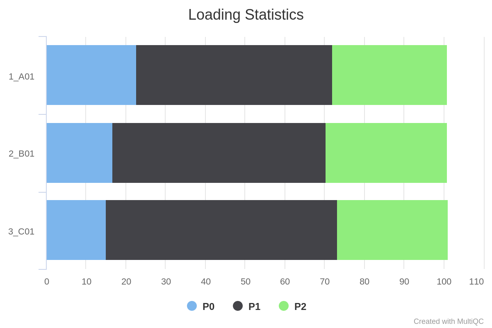
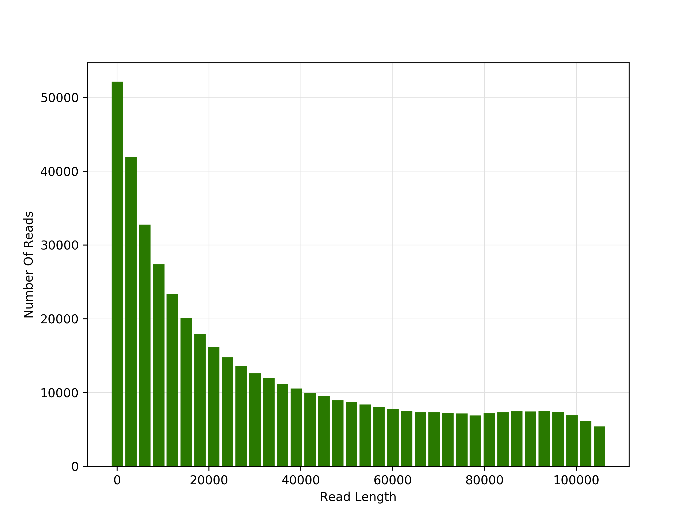
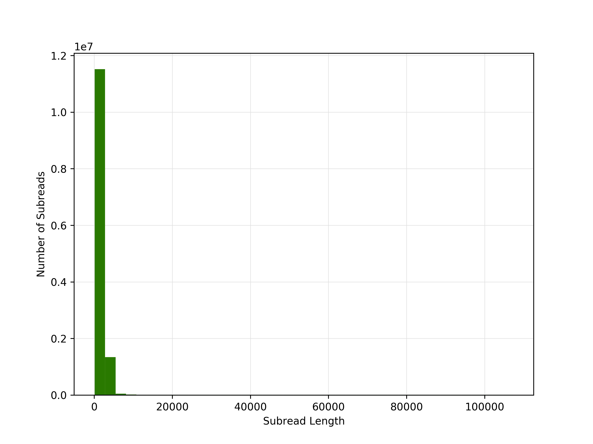
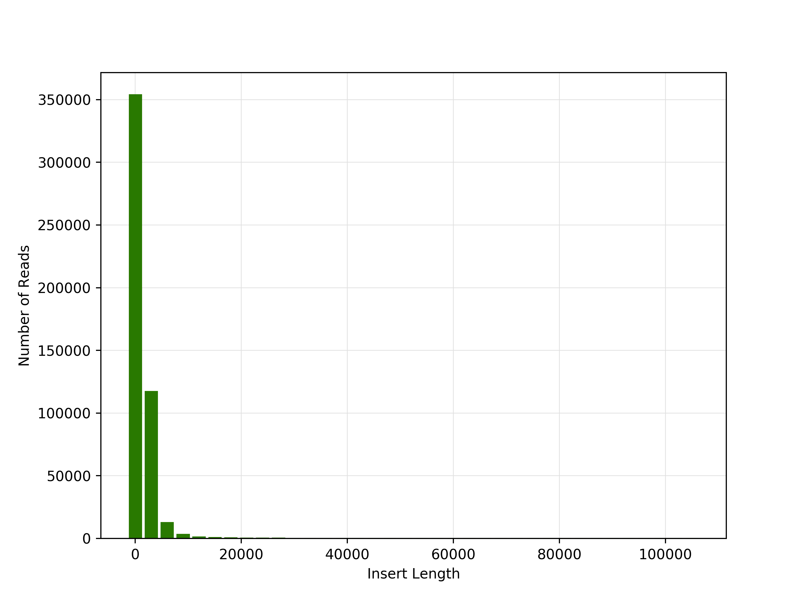
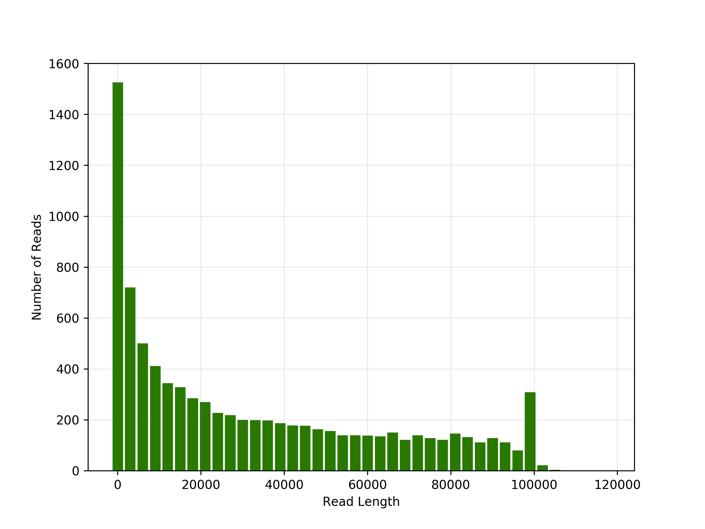
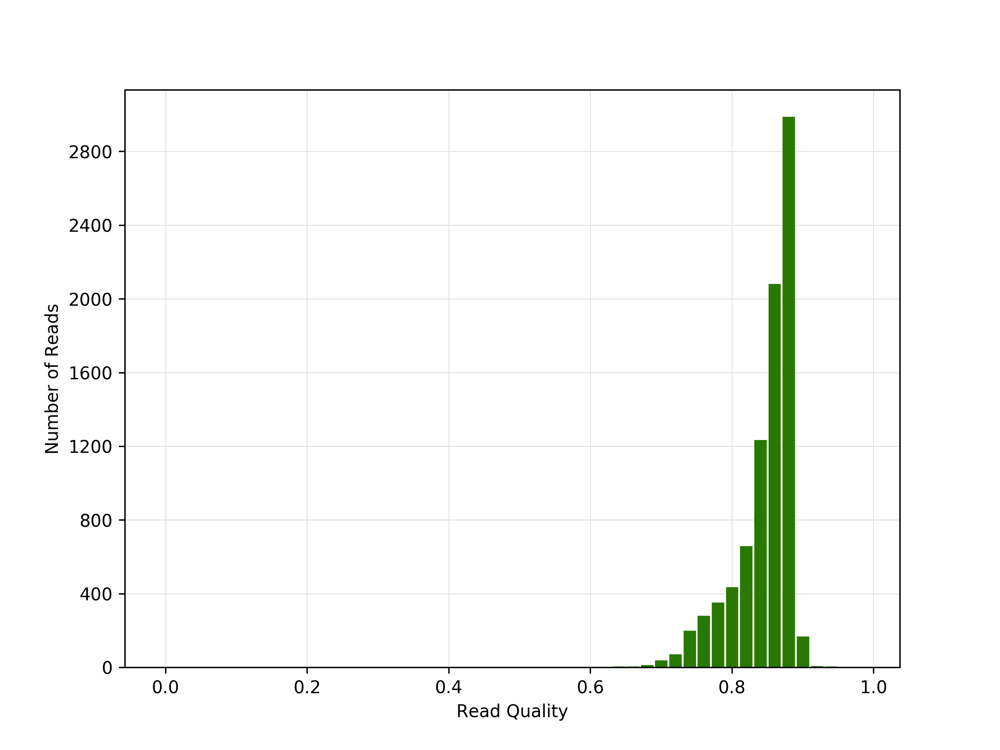
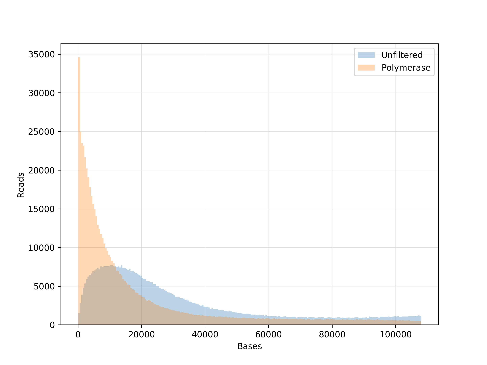
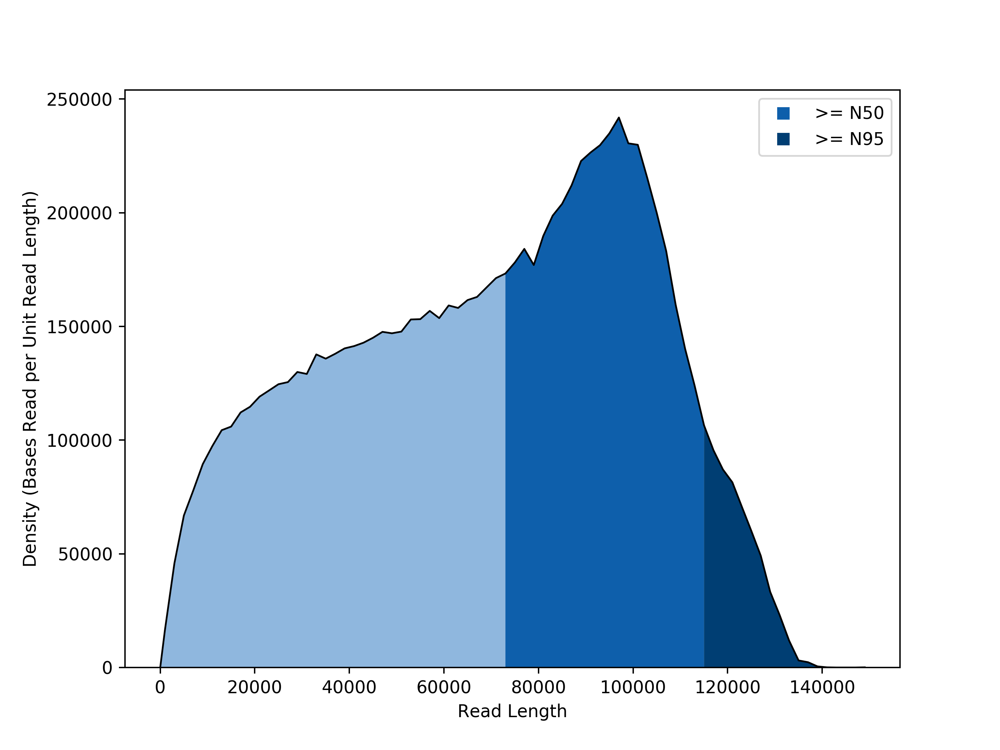
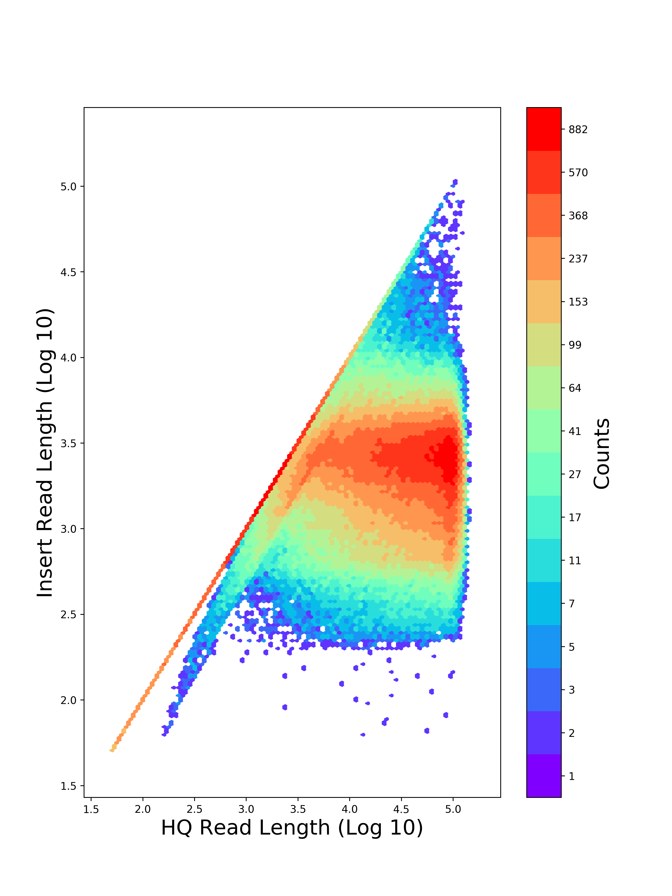

### **Output**

This document describes the outputs produced by the pipeline. All the plots are taken from the MultiQC report, which summarises results at the end of the pipeline.

### **Pipeline overview**

The pipeline is built using [Nextflow](https://www.nextflow.io/)
and processes data using the following steps:

* [RUN_QC](#SMART Link RUN QC ) - monitor performance trends and perform run QC
* [MultiQC](#multiqc) - aggregate report, describing results of the whole pipeline

### RUN QC

The goal of curie/RUN QC pipeline is to assess the overall quality of the long reads sequencing (PacBio).

> **NB:**  The input path contains the following files:

* `<filename>`.subreadset.xml
* `<filename>`.adapters.fasta  
* `<filename>`.scraps.bam 
* `<filename>`.sts.xml
* `<filename>`.subreads.bam.pbi
* `<filename>`.metadata.xml
* `<filename>`.scraps.bam.pbi
* `<filename>`.subreads.bam

###  MultiQC

[MultiQC](http://multiqc.info) is a visualisation tool that generates a single HTML report summarising all samples in your project. Most of the pipeline QC results are visualised in the report and further statistics are available in within the report data directory.

The pipeline has special steps which allow the software versions used to be reported in the MultiQC output for future traceability.

**Output directory: `results/multiqc`**

* `pbRunQC_report.html`
    * MultiQC report - a standalone HTML file that can be viewed in your web browser
* `multiqc_data/`
    * Directory containing parsed statistics from the different tools used in the pipeline

> **NB:** The MultiQC plots displayed Only if `skip_multiqc` has not been specified. 

For more information about how to use MultiQC reports, see http://multiqc.info

### Short comprehension passage of plots
The output contains plots of an individual SMRT Cell. Clicking on an individual plot displays an expanded view. These plots include:
 

|  Description      |  plot  |
| ------ | ------ |
|**Productivity graph**  compares 'typical' values for the different productivity levels. 
*  P0: Empty ZMW; no signal detected.
*  P1: ZMW with a high quality read detected.
*  P2: Other, signal detected but no high quality read.  | |
|**Polymerase Read Length** Plots the number of reads against the polymerase read length. Polymerase read represents a sequence of nucleotides incorporated by the DNA polymerase while reading a template, such as a circular SMRTbell™ template.| |
|**Subraed Length** Plots the number of reads against the against the subread length, in base pairs. Subread contain a sequence from a single pass of a polymerase on a single strand of an insert within a SMRTbell™ template and no adapter sequences.| | 
|**Estimated Insert Length** Plots the number of reads against the estimated insert length. The Insert Size is the length of the double-stranded nucleic acid fragment in a SMRTbell template, excluding the hairpin adapters.| | 
|**Control Polymerase RL** Displays the Polymerase read length distribution of the control, if used| | 
|**Control Concordance** Maps control reads against the known control reference and reports the concordance | |
|**Loading Evaluation**Displays the length distribution of unfiltered and filtered (polymerase) reads.| | 
|**Base Υield Density** Displays the number of bases sequenced in the collection, according to the length of the read in which they were observed. Regions of the graph corresponding to bases found in reads  longer than the N50 and N95 values are shaded in medium and dark blue, respectively.| |
|**Insert Length Versus Read Length**  Displays a density plot of reads, hexagonally binned according to their HQ Read Length and median subread length. For very large insert libraries, most reads consist of a single subread and will fall along the diagonal. For shorter inserts, subreads will be shorter than the HQ read length, and will appear as horizontal features.| |
  

For more information see here https://www.pacb.com/support/documentation/
